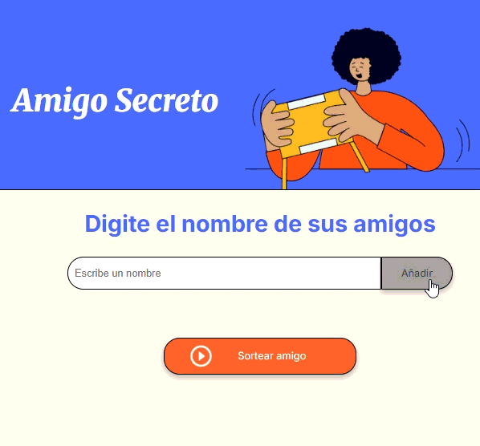

<h1 aling="center">Challenge amigo secreto//Alura Latam Oracle Next Education (ONE) - Gen 9 </h1>

Estado del proyecto: Finalizado
Versión: 1.0

:pager: Prueba la aplicación: https://gabriel-u-sa.github.io/challenge-amigo-secreto/ 

Uso del aprendizaje de los cursos Alura Latam, sobre logica de programación, JavaScript, Git y GitHub. El proyecto permite realizar el sorteo de amigo secreto con los nombres previamente ingresados.

<h2>Objetivo del proyecto:</h2>

El objetivo principal del proyecto es la practica de la logica de programación, mediante un juego interactivo que funciona en el navegador.

<h2>Tecnologias utilizadas:</h2>

    - JavaScript
    - HTML
    - CSS

<h2>Funcionalidades:</h2>

1. Agregar nombres de amigos a una lista.
2. Visualización de los participantes añadidos.

3. Mensaje de alerta si se preciona "Añadir" sin colocar un nombre en el campo de texto.

4. Realizar sorteos individuales sin repetir participantes, hasta que todos los amigos hayan sido seleccionados.

5. Reiniciar la lista automaticamente luego de realizar un sorteo, si ya se habia completado uno, e intentar agregar un nuevo nombre a la lista.

<h2>¿Cómo usarlo?</h2>

1. Clona el repositorio:
    git clone https://github.com/Gabriel-U-Sa/challenge-amigo-secreto.git
2. Abre el archivo index.html en tu navegador.
3. Ingresa los nombres de los participantes y haz click en "Añadir".
4. Presiona el botón "Sortear amigo" para obtener un amigo secreto.

<h2>Contribuciones:</h2>

¡Las contribuciones son bienvenidas! Si tienes ideas para mejorar la lógica, interfaz o agregar nuevas funcionalidades, puedes hacer un fork del repositorio y enviar un pull request.

:wrench: Autor: Desarrollado por Gabriel-U-Sa
